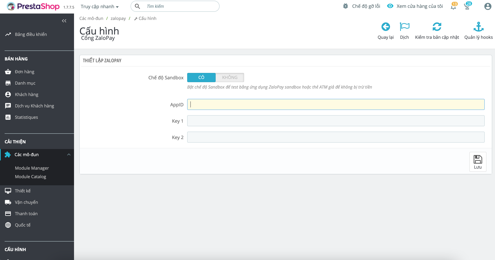
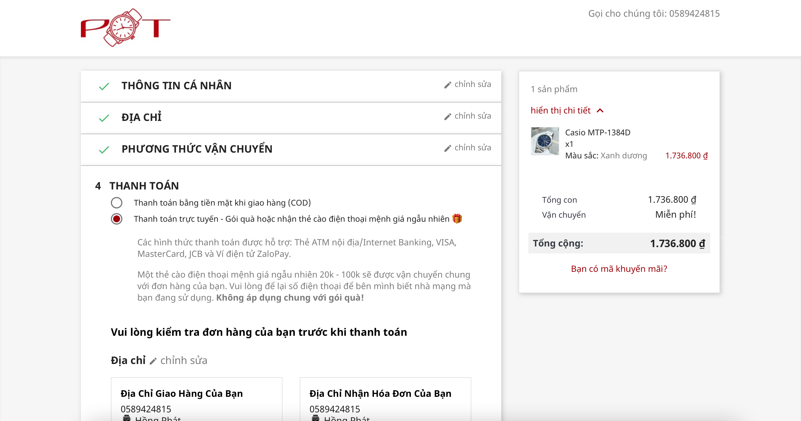
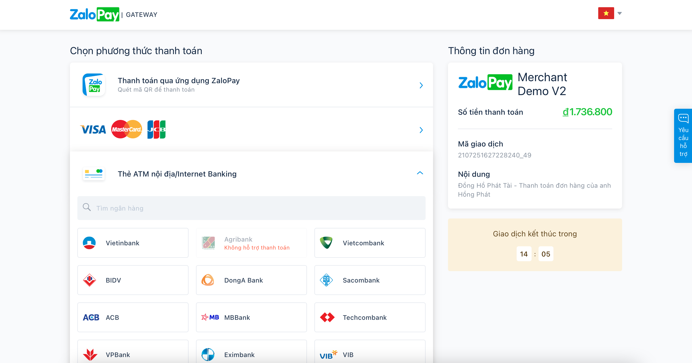
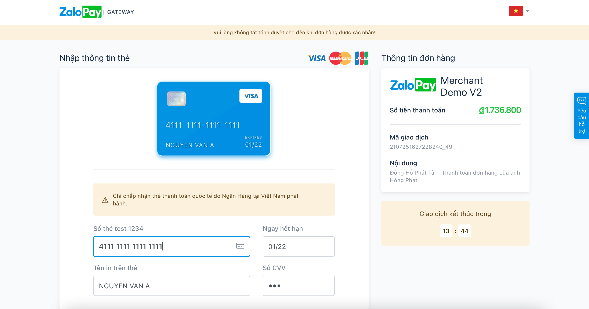
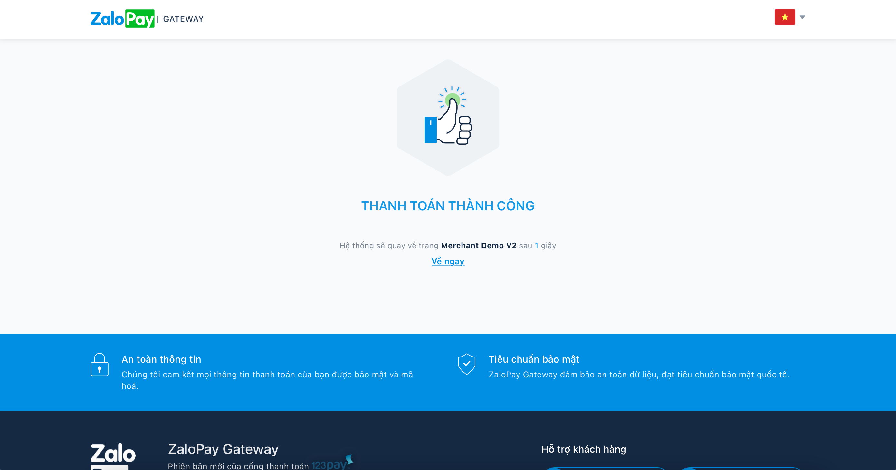
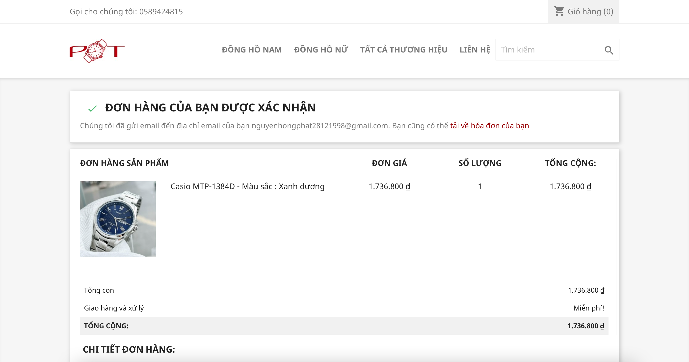

# Prestashop ZaloPay

Thanh toán trực tuyến qua Cổng ZaloPay

## Install

1. Vào mục release, tải file zalopay.zip về
2. Đăng nhập vào Admin cửa hàng Prestashop của bạn, cài đặt module bằng file zip vừa tải
3. Ở trang cấu hình module, nhập App ID và Key 1, Key 2 vào. Đăng ký ZaloPay Merchant để có được các key trên

Cấu hình | Đặt hàng | Chọn phương thức thanh toán | Tiến hành thanh toán | Thanh toán thành công | Đơn hàng được tạo
:-:|:-:|:-:|:-:|:-:|:-:
 |  |  |  |  | 

## Contributing

Nguyễn Hồng Phát

## License

This module is released under the [Academic Free License 3.0][AFL-3.0] 

[documentation]: https://devdocs.prestashop.com/1.7/modules/
[prestashop]: https://www.prestashop.com/
[contribution-guidelines]: https://devdocs.prestashop.com/1.7/contribute/contribution-guidelines/project-modules/
[AFL-3.0]: https://opensource.org/licenses/AFL-3.0
